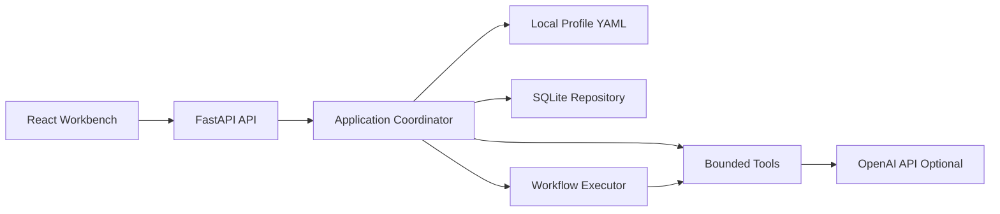
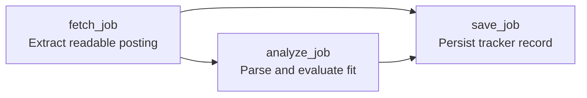

# CareerPilot

CareerPilot is a local-first AI career workbench for analyzing jobs, tracking applications, tailoring resumes, and building interview preparation plans.

It is designed for people who want a private, hackable career assistant they can run on their own machine. You bring your profile, resume, target roles, and job links; CareerPilot helps turn that context into structured analysis, saved applications, prep plans, and resume drafts.

## What You Can Do

- Analyze pasted job descriptions or individual job links.
- Fetch JavaScript-rendered career pages with Playwright when needed.
- Score role fit against your local profile, career goals, and preferences.
- Identify strengths, gaps, concerns, resume emphasis, and prep topics.
- Save jobs into a local SQLite application tracker.
- Regenerate saved analysis while preserving application status and analysis history.
- Chat globally across your profile, saved jobs, and local chat history.
- Ask the global assistant to run approved local actions such as comparing saved jobs, generating prep plans, generating resume drafts, or updating profile memory after confirmation.
- Chat about a specific saved job or an unsaved analysis preview.
- Enable optional OpenAI web search for current company or interview context.
- Generate interview prep plans with daily checklist items.
- Generate role-targeted resume PDF drafts.
- Upload or paste resume text and review proposed profile updates.
- Track background job ingestion through workflow graph and trace events.

## Who It Is For

- Job seekers who want a private workspace for comparing roles and preparing intentionally.
- Engineers who want to inspect or extend a real AI-assisted career workflow.
- Developers learning how to build agentic applications with controlled tools, typed outputs, traces, and local persistence.

## Design Principles

- **Local-first privacy**: your private profile, job database, chat history, generated resumes, and API keys stay out of Git.
- **Review before mutation**: profile updates, saved analysis refreshes, and generated artifacts are explicit and auditable.
- **Structured AI output**: LLM calls produce typed artifacts instead of untracked free-form blobs.
- **Bounded tools**: assistant-planned actions must pass backend allow-list and approval checks.
- **Observable workflows**: long-running operations expose graph and trace artifacts for debugging.
- **Framework-neutral contracts**: CareerPilot owns the product contracts while LangGraph can run selected workflows behind a runtime boundary.

## Architecture Highlights



Important backend concepts:

- **FastAPI backend**: local API surface for analysis, chat, prep plans, resumes, and tracking.
- **React frontend**: workbench for reviewing jobs, chats, plans, profile memory, and workflow status.
- **Local profile memory**: user background and preferences live in an ignored YAML file.
- **SQLite persistence**: saved jobs, chat history, prep plans, resume versions, profile proposals, and background tasks.
- **Typed LLM contracts**: Pydantic models define structured parser, scoring, guidance, and artifact outputs.
- **Agent skill catalog**: reusable guidance is stored separately from executable tools.
- **Workflow DAG executor**: approved workflow templates run allow-listed tools with dependency-output passing, blocking, and trace events.
- **Extraction learning layer**: local selector observations help reduce noisy career-page content without executing generated code.

## Demo Workflow

The background job ingestion workflow is the first explicit agentic runtime path. It supports both preview analysis and durable saves:



When `save=false`, the workflow stops after `analyze_job` and returns the analysis as a task artifact for the preview UI. When `save=true`, it continues through `save_job` and persists the tracker record.

Saved-job refresh uses the same preview path. The refreshed candidate analysis is reviewed on the Analyze page, then applied through a resource update to the saved job analysis.

The backend stores:

- `workflow_graph`: planned nodes, edges, version, and final task statuses
- `workflow_run`: runtime status and trace events such as `started`, `completed`, `failed`, and `blocked`

This keeps the frontend focused on presentation while the backend owns workflow semantics.

## Tech Stack

- Python
- FastAPI
- Pydantic
- SQLite
- OpenAI API, optional
- Playwright, optional
- React
- TypeScript
- Vite
- Tailwind CSS
- Pytest

## Quick Start

### Short path

CareerPilot includes a small helper script for the commands used most often:

```bash
scripts/careerpilot setup
scripts/careerpilot dev
```

Then open:

```text
http://127.0.0.1:5173
```

Useful follow-up commands:

```bash
scripts/careerpilot check
scripts/careerpilot test
scripts/careerpilot backend
scripts/careerpilot frontend
scripts/careerpilot eval
```

Run `scripts/careerpilot help` to see all supported commands.

### 1. Clone and create a Python environment

```bash
git clone git@github.com:David-ChenH/CareerPilot.git
cd CareerPilot
python -m venv .venv
source .venv/bin/activate
```

On Windows PowerShell:

```powershell
python -m venv .venv
.\.venv\Scripts\Activate.ps1
```

### 2. Install backend dependencies

```bash
pip install -e ".[dev]"
```

Optional browser fetching support:

```bash
pip install -e ".[dev,browser]"
playwright install chromium
```

Optional AI support, including OpenAI API usage and LangGraph runtime experiments:

```bash
pip install -e ".[dev,ai]"
cp .env.example .env
```

Then edit `.env`:

```text
OPENAI_API_KEY=your_api_key_here
JOB_AGENT_LLM_MODEL=gpt-4o-mini
JOB_AGENT_WEB_SEARCH_MODEL=gpt-5.4-mini
JOB_AGENT_PLANNER_MODEL=gpt-4o-mini
```

You can combine extras:

```bash
pip install -e ".[dev,browser,ai]"
```

### 3. Create a local profile

```bash
cp app/memory/profile.example.yaml app/memory/profile.local.yaml
```

Edit `app/memory/profile.local.yaml` with your own identity, education, skills, projects, target roles, preferences, and avoid-list. The file uses `profile_schema_version: 1`, the first official CareerPilot profile schema.

If no local profile exists, CareerPilot uses the generic example profile.

### 4. Run the backend

```bash
uvicorn app.main:app --reload
```

Backend:

```text
http://127.0.0.1:8000
```

API docs:

```text
http://127.0.0.1:8000/docs
```

### 5. Run the React workbench

Use Node 24. The repo includes `.nvmrc` and `.node-version`.

```bash
cd frontend
npm install
npm run dev
```

Frontend:

```text
http://127.0.0.1:5173
```

The Vite dev server proxies API calls to the FastAPI backend.

## Privacy Model

CareerPilot is local-first. Private user data should stay out of Git.

Ignored local files include:

- `.env`
- `.venv/`
- `data/`
- `*.sqlite3`
- `*.db`
- `app/memory/profile.local.yaml`
- `app/memory/profile.yaml`
- `frontend/dist/`
- `node_modules/`

Before pushing, check:

```bash
git status --short --ignored
```

Personal files should appear as ignored, not staged.

## Project Structure

```text
app/
  main.py                         FastAPI entry point
  agents/
    coordinator.py                Application orchestration layer
    action_registry.py            Allow-listed chat-triggered actions
  agent_skills/
    career_page_extraction/       Reusable agent guidance
  db/
    models.py                     Pydantic data models
    repository.py                 SQLite persistence
  memory/
    profile.example.yaml          Public profile template
    profile_store.py              Local profile loading and updates
  tools/
    browser_job_fetcher.py        Playwright-based career page extraction
    job_fetcher.py                HTTP and JSON-LD fetching
    llm_job_parser.py             Structured LLM extraction
    llm_job_scorer.py             Semantic fit evaluator
    prep_planner.py               Prep plan generation
    resume_generator.py           Resume draft generation
  workflows/
    dag.py                        DAG validation and ready groups
    executor.py                   Dependency-aware workflow runtime
    graph.py                      Serializable workflow graph artifact
    job_ingestion.py              Background job-link workflow
frontend/
  src/
    App.tsx                       React workbench
    api.ts                        Typed API client
    types.ts                      Frontend data contracts
docs/
  README.md                       Documentation index
  architecture.md                 System design overview
  learning_guide.md               Learning notes and design patterns
  roadmap.md                      Project status and next priorities
  ingestion.md                    Job URL fetching and extraction strategy
  workflow_runtime.md             Agent workflow runtime roadmap
  evaluation.md                   Job-analysis quality eval strategy
tests/
  test_job_analysis.py
  test_job_analysis_evals.py
  test_workflow_foundation.py
evals/
  job_analysis/cases.yaml         Frozen eval fixtures
  profiles/                       Stable eval profiles
```

## Development Commands

The preferred local helper is:

```bash
scripts/careerpilot check
```

It runs tests, Python compilation, frontend build, and whitespace diff checks.

Run backend tests:

```bash
scripts/careerpilot test
```

Run Python compilation check:

```bash
.venv/bin/python -m compileall app
```

Run frontend production build:

```bash
scripts/careerpilot build
```

Run job-analysis evals:

```bash
scripts/careerpilot eval
```

Run evals with LLM parsing/scoring/guidance:

```bash
scripts/careerpilot eval-llm
```

## For Developers

CareerPilot is also a reference project for building production-style AI applications. The implementation emphasizes:

- controlled tool execution instead of arbitrary model actions
- typed workflow templates instead of unbounded autonomy
- explicit local memory updates instead of silent profile mutation
- semantic LLM analysis with schema validation
- LLM assistant planning with backend action validation and approval gates
- observable background workflows with graph and trace artifacts
- a native workflow runtime plus a LangGraph runtime boundary
- local evaluation fixtures for regression testing
- privacy boundaries around profile, application history, and secrets

A concise architecture summary:

> CareerPilot is a local AI career workbench with production-style agent workflow foundations. The app separates prompts, tools, workflow templates, and persistence. Chat intent is interpreted by an LLM planner, while the backend validates allow-listed actions and approval rules. Workflows run through typed DAG contracts with trace artifacts, and LangGraph can sit behind the same runtime boundary for stateful orchestration.

## Documentation

- [Architecture](docs/architecture.md)
- [Learning Guide](docs/learning_guide.md)
- [Roadmap](docs/roadmap.md)
- [Workflow Runtime](docs/workflow_runtime.md)
- [Ingestion](docs/ingestion.md)
- [Evaluation Strategy](docs/evaluation.md)

## Roadmap

Near-term:

- richer prep-plan workflow DAG with parallel branches
- richer assistant action confirmation UI
- LangGraph-backed prep-plan runtime hardening: checkpointing, approval interrupts, and retries
- model routing and cost tracking
- cache keys for reusable intermediate outputs
- persistent workflow traces
- stronger eval coverage for analysis quality

Later:

- Docker support
- optional Postgres or pgvector backend
- target-company watchlist ingestion
- deployment and worker architecture

## License

CareerPilot is released under the [MIT License](LICENSE).
