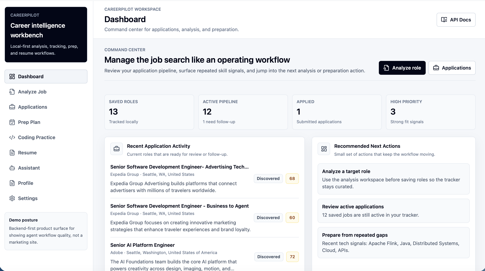
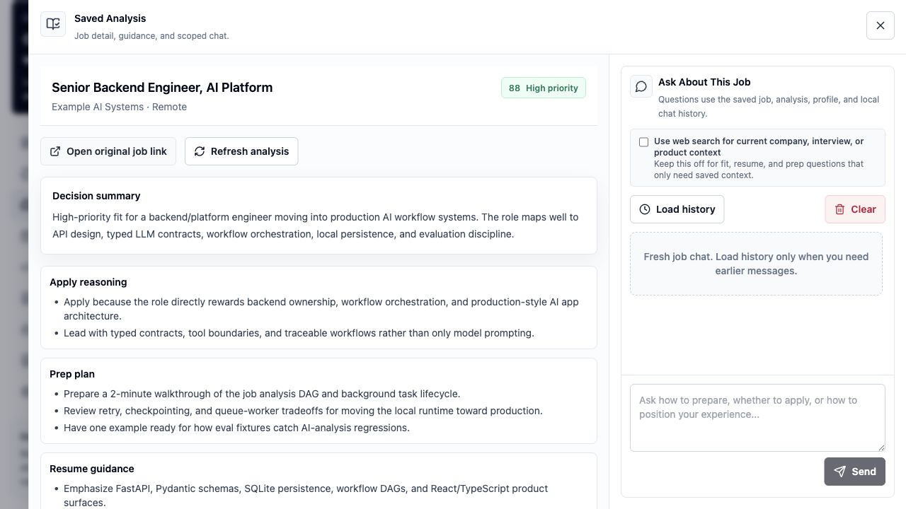
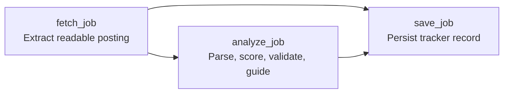

# CareerPilot

Local-first AI career workbench built as a production-style agentic workflow system.

CareerPilot helps analyze job posts, compare role fit, track applications, generate prep plans, and draft targeted resumes while keeping private profile data, job history, generated resumes, and API keys local.

The project is also a backend/AI-platform portfolio piece: typed LLM contracts, bounded tool execution, workflow DAGs, traceable background tasks, local persistence, and eval-driven iteration.

The workspace opens on a command-center dashboard for the application pipeline, repeated skill signals, and next actions.



From there, each saved role can expand into a focused analysis workspace with fit rationale, prep guidance, resume positioning, and scoped job chat.



## Why This Project Exists

Most AI app demos stop at a prompt and a chat box. CareerPilot is intentionally shaped around the parts that make AI systems production-like:

- product workflows separated from prompts, tools, and persistence
- typed schemas around LLM-generated artifacts
- backend-owned allow-lists for assistant actions
- explicit review before profile, application, or artifact mutation
- durable task records for long-running work
- local eval fixtures for AI-assisted behavior
- privacy boundaries for user data, generated resumes, and secrets

The product domain is career workflow management. The engineering focus is agent workflow infrastructure.

## Engineering Highlights

- **FastAPI backend** with Pydantic contracts for analysis, scoring, guidance, profile updates, prep plans, and resume artifacts.
- **React/TypeScript workbench** for reviewing analyses, tracking applications, chatting about saved jobs, and monitoring workflow progress.
- **Dependency-aware workflow runtime** with DAG validation, dependency-output passing, failure blocking, model-tier metadata, and trace events.
- **Allow-listed assistant actions** for approved local operations instead of arbitrary model tool execution.
- **Local-first persistence** with SQLite plus ignored profile, resume, job history, database, and secret files.
- **Structured LLM boundaries** for parsing, semantic fit evaluation, validation, guidance, resume generation, and profile proposals.
- **Evaluation-oriented development** with pytest coverage and frozen job-analysis fixtures for regression testing.
- **Runtime boundary for LangGraph** so framework-backed orchestration can replace the native executor without taking over product contracts.

## Product Capabilities

- Analyze pasted job descriptions or individual job links.
- Fetch JavaScript-rendered career pages with Playwright when needed.
- Score role fit against a local profile, career goals, and role preferences.
- Identify strengths, gaps, concerns, resume emphasis, prep topics, and interview focus.
- Save jobs into a local SQLite application tracker.
- Regenerate saved analysis while preserving application status and analysis history.
- Chat globally across profile, saved jobs, application status, and local chat history.
- Ask the assistant to run approved local actions such as comparing saved jobs, generating prep plans, generating resume drafts, or updating profile memory after confirmation.
- Chat about a specific saved job or an unsaved analysis preview.
- Generate interview prep plans with daily checklist items.
- Generate role-targeted resume PDF drafts.
- Upload or paste resume text and review proposed profile updates.
- Track background job ingestion through workflow graph and trace events.

## Architecture


Important backend concepts:

- **Application coordinator**: orchestrates profile loading, parsing, scoring, validation, guidance, persistence, and chat surfaces.
- **Local profile memory**: user background and preferences live in an ignored YAML file.
- **SQLite repository**: stores saved jobs, chat history, prep plans, resume versions, profile proposals, analysis versions, and background tasks.
- **Typed LLM contracts**: Pydantic models define structured parser, scorer, validator, guidance, resume, and profile-update outputs.
- **Action registry**: assistant-planned actions must pass backend validation and confirmation rules.
- **Workflow runtime**: approved workflow templates run allow-listed tools with dependencies, blocking, status, and traces.
- **Extraction learning layer**: local selector observations reduce noisy career-page content without executing generated code.

## Workflow Example

Background job-link ingestion is the first explicit agentic runtime path. It supports both preview analysis and durable saves:



When `save=false`, the workflow stops after `analyze_job` and returns the analysis as a task artifact for preview. When `save=true`, it continues through `save_job` and persists the tracker record.

The backend stores workflow artifacts on the task record:

- `workflow_graph`: planned nodes, edges, version, and final task statuses
- `workflow_run`: runtime status and trace events such as `started`, `completed`, `failed`, and `blocked`

The frontend renders those artifacts generically, so UI presentation stays separate from Python workflow internals.

## Key Files To Inspect

- `app/workflows/executor.py`: dependency-aware workflow runtime
- `app/workflows/job_ingestion.py`: background job-link ingestion workflow
- `app/workflows/prep_plan.py`: prep-plan workflow boundary and runtime selection
- `app/agents/action_registry.py`: allow-listed assistant actions
- `app/agents/coordinator.py`: application orchestration layer
- `app/db/repository.py`: SQLite persistence boundary
- `frontend/src/App.tsx`: workbench UI and workflow/task surfaces
- `tests/test_workflow_foundation.py`: workflow/runtime regression tests
- `tests/test_job_analysis.py`: job-analysis, persistence, profile, chat, prep, and resume behavior

## Tech Stack

- Python
- FastAPI
- Pydantic
- SQLite
- OpenAI API
- Playwright
- React
- TypeScript
- Vite
- Tailwind CSS
- Pytest

## Quick Start

CareerPilot includes a helper script for common local commands:

```bash
scripts/careerpilot setup
scripts/careerpilot dev
```

Then open:

```text
http://127.0.0.1:5173
```

Useful follow-up commands:

```bash
scripts/careerpilot check
scripts/careerpilot test
scripts/careerpilot backend
scripts/careerpilot frontend
scripts/careerpilot eval
```

Run `scripts/careerpilot help` to see all supported commands.

## Manual Setup

Clone and create a Python environment:

```bash
git clone git@github.com:David-ChenH/CareerPilot.git
cd CareerPilot
python -m venv .venv
source .venv/bin/activate
```

On Windows PowerShell:

```powershell
python -m venv .venv
.\.venv\Scripts\Activate.ps1
```

Install backend dependencies:

```bash
pip install -e ".[dev]"
```

Optional browser fetching support:

```bash
pip install -e ".[dev,browser]"
playwright install chromium
```

Optional AI support, including OpenAI API usage and LangGraph runtime experiments:

```bash
pip install -e ".[dev,ai]"
cp .env.example .env
```

Then edit `.env`:

```text
OPENAI_API_KEY=your_api_key_here
JOB_AGENT_LLM_MODEL=gpt-4o-mini
JOB_AGENT_WEB_SEARCH_MODEL=gpt-5.4-mini
JOB_AGENT_PLANNER_MODEL=gpt-4o-mini
```

You can combine extras:

```bash
pip install -e ".[dev,browser,ai]"
```

Create a local profile:

```bash
cp app/memory/profile.example.yaml app/memory/profile.local.yaml
```

Edit `app/memory/profile.local.yaml` with your own identity, education, skills, projects, target roles, preferences, and avoid-list. If no local profile exists, CareerPilot uses the generic example profile.

Run the backend:

```bash
uvicorn app.main:app --reload
```

Backend:

```text
http://127.0.0.1:8000
```

API docs:

```text
http://127.0.0.1:8000/docs
```

Run the React workbench:

```bash
cd frontend
npm install
npm run dev
```

Frontend:

```text
http://127.0.0.1:5173
```

The Vite dev server proxies API calls to the FastAPI backend.

## Privacy Model

CareerPilot is local-first. Private user data should stay out of Git.

Ignored local files include:

- `.env`
- `.venv/`
- `data/`
- `*.sqlite3`
- `*.db`
- `app/memory/profile.local.yaml`
- `app/memory/profile.yaml`
- `frontend/dist/`
- `node_modules/`

Before pushing, check:

```bash
git status --short --ignored
```

Personal files should appear as ignored, not staged.

## Development Commands

Run the full local check:

```bash
scripts/careerpilot check
```

This runs tests, Python compilation, frontend build, and whitespace diff checks.

Run backend tests:

```bash
scripts/careerpilot test
```

Run Python compilation check:

```bash
.venv/bin/python -m compileall app
```

Run frontend production build:

```bash
scripts/careerpilot build
```

Run job-analysis evals:

```bash
scripts/careerpilot eval
```

Run evals with LLM parsing/scoring/guidance:

```bash
scripts/careerpilot eval-llm
```

## Project Structure

```text
app/
  main.py                         FastAPI entry point
  agents/
    coordinator.py                Application orchestration layer
    action_registry.py            Allow-listed chat-triggered actions
  agent_skills/
    career_page_extraction/       Reusable agent guidance
  db/
    models.py                     Pydantic data models
    repository.py                 SQLite persistence
  memory/
    profile.example.yaml          Public profile template
    profile_store.py              Local profile loading and updates
  tools/
    browser_job_fetcher.py        Playwright-based career page extraction
    job_fetcher.py                HTTP and JSON-LD fetching
    llm_job_parser.py             Structured LLM extraction
    llm_job_scorer.py             Semantic fit evaluator
    prep_planner.py               Prep plan generation
    resume_generator.py           Resume draft generation
  workflows/
    dag.py                        DAG validation and ready groups
    executor.py                   Dependency-aware workflow runtime
    graph.py                      Serializable workflow graph artifact
    job_ingestion.py              Background job-link workflow
    prep_plan.py                  Prep-plan workflow runtime boundary
frontend/
  src/
    App.tsx                       React workbench
    api.ts                        Typed API client
    types.ts                      Frontend data contracts
docs/
  README.md                       Documentation index
  architecture.md                 System design overview
  learning_guide.md               Learning notes and design patterns
  roadmap.md                      Project status and next priorities
  ingestion.md                    Job URL fetching and extraction strategy
  workflow_runtime.md             Agent workflow runtime roadmap
  evaluation.md                   Job-analysis quality eval strategy
tests/
  test_job_analysis.py
  test_job_analysis_evals.py
  test_workflow_foundation.py
evals/
  job_analysis/cases.yaml         Frozen eval fixtures
  profiles/                       Stable eval profiles
```

## Documentation

- [Architecture](docs/architecture.md)
- [Learning Guide](docs/learning_guide.md)
- [Roadmap](docs/roadmap.md)
- [Workflow Runtime](docs/workflow_runtime.md)
- [Ingestion](docs/ingestion.md)
- [Evaluation Strategy](docs/evaluation.md)

## Roadmap

Near-term:

- richer prep-plan workflow DAG with parallel branches
- richer assistant action confirmation UI
- LangGraph-backed prep-plan runtime hardening: checkpointing, approval interrupts, and retries
- model routing and cost tracking
- cache keys for reusable intermediate outputs
- persistent workflow traces
- stronger eval coverage for analysis quality

Later:

- Docker support
- optional Postgres or pgvector backend
- target-company watchlist ingestion
- deployment and worker architecture

## License

CareerPilot is released under the [MIT License](LICENSE).
