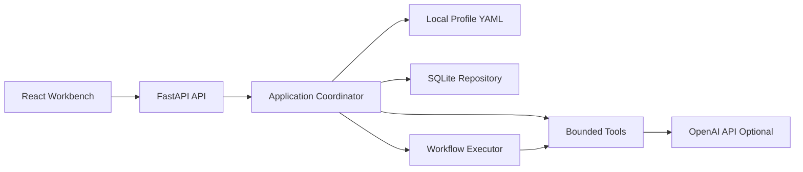
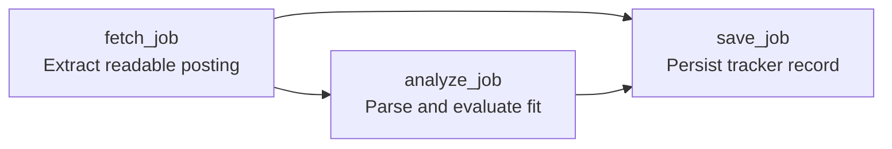

# CareerPilot

CareerPilot is a local-first AI career workbench for job analysis, application tracking, resume targeting, preparation planning, and agentic workflow experimentation.

The project is designed as both a useful personal job-search tool and a production-style learning project for backend engineers exploring AI platform and agent workflow infrastructure.

## Why This Project Exists

Many AI job-search demos are thin chatbots over a resume and a job description. CareerPilot takes a more backend/platform-oriented approach:

- job links are fetched and extracted through bounded tools
- profile memory is stored locally and explicitly updated
- LLM outputs are represented with typed schemas
- background operations run through an observable workflow DAG
- generated artifacts carry provenance and versions
- chat can trigger approved actions without executing arbitrary code

The goal is to demonstrate how agentic applications can be built with controlled execution, traceability, evaluation hooks, and clear privacy boundaries.

## Features

- Analyze pasted job descriptions or individual job links.
- Fetch JavaScript-rendered career pages with Playwright when needed.
- Combine JSON-LD metadata, rendered page structure, and LLM semantic analysis.
- Score role fit against a local user profile and career goals.
- Identify strengths, skill gaps, concerns, resume emphasis, and prep topics.
- Save jobs into a local SQLite application tracker.
- Regenerate saved analysis while preserving application status and analysis history.
- Chat globally across profile, saved jobs, and local history.
- Chat about a specific saved job or analysis preview.
- Enable optional OpenAI web search for current company/interview context.
- Generate interview prep plans with daily checklist items.
- Generate role-targeted resume PDF drafts.
- Upload or paste resume text and review proposed profile updates.
- Track background job ingestion through workflow graph and trace events.

## Architecture Highlights



Important backend concepts:

- **FastAPI backend**: local API surface for analysis, chat, prep plans, resumes, and tracking.
- **React frontend**: demo workbench for reviewing jobs, chats, plans, profile memory, and workflow status.
- **Local profile memory**: user background and preferences live in an ignored YAML file.
- **SQLite persistence**: saved jobs, chat history, prep plans, resume versions, profile proposals, and background tasks.
- **Typed LLM contracts**: Pydantic models define structured parser, scoring, guidance, and artifact outputs.
- **Agent skill catalog**: reusable guidance is stored separately from executable tools.
- **Workflow DAG executor**: approved workflow templates run allow-listed tools with dependency-output passing, blocking, and trace events.
- **Extraction learning layer**: local selector observations help reduce noisy career-page content without executing generated code.

## Demo Workflow

The background job ingestion workflow is the first explicit agentic runtime path:



The backend stores:

- `workflow_graph`: planned nodes, edges, version, and final task statuses
- `workflow_run`: runtime status and trace events such as `started`, `completed`, `failed`, and `blocked`

This keeps the frontend focused on presentation while the backend owns workflow semantics.

## Tech Stack

- Python
- FastAPI
- Pydantic
- SQLite
- OpenAI API, optional
- Playwright, optional
- React
- TypeScript
- Vite
- Tailwind CSS
- Pytest

## Quick Start

### 1. Clone and create a Python environment

```bash
git clone git@github.com:David-ChenH/CareerPilot.git
cd CareerPilot
python -m venv .venv
source .venv/bin/activate
```

On Windows PowerShell:

```powershell
python -m venv .venv
.\.venv\Scripts\Activate.ps1
```

### 2. Install backend dependencies

```bash
pip install -e ".[dev]"
```

Optional browser fetching support:

```bash
pip install -e ".[dev,browser]"
playwright install chromium
```

Optional LLM support:

```bash
pip install -e ".[dev,ai]"
cp .env.example .env
```

Then edit `.env`:

```text
OPENAI_API_KEY=your_api_key_here
JOB_AGENT_LLM_MODEL=gpt-4o-mini
JOB_AGENT_WEB_SEARCH_MODEL=gpt-5.4-mini
```

You can combine extras:

```bash
pip install -e ".[dev,browser,ai]"
```

### 3. Create a local profile

```bash
cp app/memory/profile.example.yaml app/memory/profile.local.yaml
```

Edit `app/memory/profile.local.yaml` with your own background, target roles, skills, preferences, and avoid-list.

If no local profile exists, CareerPilot uses the generic example profile.

### 4. Run the backend

```bash
uvicorn app.main:app --reload
```

Backend:

```text
http://127.0.0.1:8000
```

API docs:

```text
http://127.0.0.1:8000/docs
```

### 5. Run the React workbench

Use Node 24. The repo includes `.nvmrc` and `.node-version`.

```bash
cd frontend
npm install
npm run dev
```

Frontend:

```text
http://127.0.0.1:5173
```

The Vite dev server proxies API calls to the FastAPI backend.

## Privacy Model

CareerPilot is local-first. Private user data should stay out of Git.

Ignored local files include:

- `.env`
- `.venv/`
- `data/`
- `*.sqlite3`
- `*.db`
- `app/memory/profile.local.yaml`
- `app/memory/profile.yaml`
- `frontend/dist/`
- `node_modules/`

Before pushing, check:

```bash
git status --short --ignored
```

Personal files should appear as ignored, not staged.

## Project Structure

```text
app/
  main.py                         FastAPI entry point
  agents/
    coordinator.py                Application orchestration layer
    action_registry.py            Allow-listed chat-triggered actions
  agent_skills/
    career_page_extraction/       Reusable agent guidance
  db/
    models.py                     Pydantic data models
    repository.py                 SQLite persistence
  memory/
    profile.example.yaml          Public profile template
    profile_store.py              Local profile loading and updates
  tools/
    browser_job_fetcher.py        Playwright-based career page extraction
    job_fetcher.py                HTTP and JSON-LD fetching
    llm_job_parser.py             Structured LLM extraction
    llm_job_scorer.py             Semantic fit evaluator
    prep_planner.py               Prep plan generation
    resume_generator.py           Resume draft generation
  workflows/
    dag.py                        DAG validation and ready groups
    executor.py                   Dependency-aware workflow runtime
    graph.py                      Serializable workflow graph artifact
    job_ingestion.py              Background job-link workflow
frontend/
  src/
    App.tsx                       React workbench
    api.ts                        Typed API client
    types.ts                      Frontend data contracts
docs/
  architecture.md                 System design overview
  learning_guide.md               Learning notes and design patterns
  workflow_runtime_plan.md        Agent workflow runtime roadmap
  self_evolving_extraction.md     Selector learning design
tests/
  test_job_analysis.py
  test_job_analysis_evals.py
  test_workflow_foundation.py
evals/
  job_analysis/cases.yaml         Frozen eval fixtures
  profiles/                       Stable eval profiles
```

## Development Commands

Run backend tests:

```bash
pytest
```

Run Python compilation check:

```bash
python -m compileall app
```

Run frontend production build:

```bash
cd frontend
npm run build
```

Run job-analysis evals:

```bash
careerpilot-eval
```

Run evals with LLM parsing/scoring/guidance:

```bash
careerpilot-eval --llm --json
```

## Learning And Interview Value

CareerPilot is intentionally shaped around backend and AI platform concerns:

- controlled tool execution instead of arbitrary model actions
- typed workflow templates instead of unbounded autonomy
- explicit local memory updates instead of silent profile mutation
- semantic LLM analysis with schema validation
- observable background workflows with graph and trace artifacts
- local evaluation fixtures for regression testing
- privacy boundaries around profile, application history, and secrets

A concise interview explanation:

> CareerPilot started as a local AI job-search workbench, but I designed it as an agent workflow platform exercise. The app separates prompts, tools, workflow templates, and persistence. Background job ingestion runs through a typed DAG executor with allow-listed tools, dependency-output passing, failure blocking, and trace artifacts. This lets me discuss production agent concerns such as observability, evaluation, memory, cost control, retries, and future LangGraph migration from a concrete codebase.

## Documentation

- [Architecture](docs/architecture.md)
- [Learning Guide](docs/learning_guide.md)
- [Project Roadmap](docs/project_roadmap.md)
- [Workflow Runtime Plan](docs/workflow_runtime_plan.md)
- [Self-Evolving Extraction](docs/self_evolving_extraction.md)
- [Evaluation Strategy](docs/evaluation.md)
- [Job Fetching Tradeoffs](docs/job_fetching_tradeoffs.md)
- [Target Company Ingestion Plan](docs/target_company_ingestion_plan.md)

## Roadmap

Near-term:

- richer prep-plan workflow DAG with parallel branches
- model routing and cost tracking
- cache keys for reusable intermediate outputs
- persistent workflow traces
- stronger eval coverage for analysis quality

Later:

- LangGraph adapter comparison
- Docker support
- optional Postgres or pgvector backend
- target-company watchlist ingestion
- deployment and worker architecture

## License

CareerPilot is released under the [MIT License](LICENSE).
