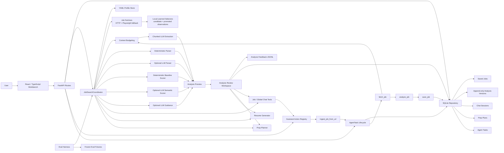
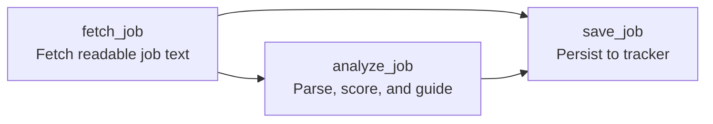
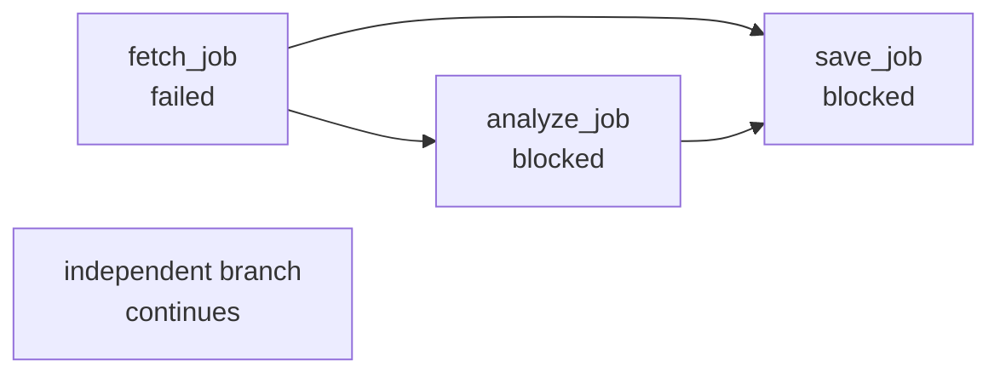

# Architecture

## System graph

## Agent task lifecycle

The first explicit task workflow is background job-link ingestion:

The same task workflow can now be started from two surfaces:

- the Analyze page `Save in background` button
- the global Assistant when the user pastes a job URL and asks to analyze, save, track, or ingest it

The Assistant does not scrape the page directly. It routes intent to the allow-listed `ingest_job_from_url` action, which creates a persistent `AgentTask`. The `job_ingestion` workflow template then runs through the framework-neutral `WorkflowExecutor`, which owns dependency order, output passing, failure blocking, and trace events while the existing `AgentTask` row remains the UI-facing progress record.

The UI receives two observable runtime artifacts:

- `workflow_graph`: the workflow nodes, edges, version, and final task statuses.
- `workflow_run`: the execution status and trace events, excluding large tool outputs.

This lets the product display workflow progress without coupling the frontend to Python task classes.

Failure handling is dependency-aware:

Each `AgentTask` persists:

- task type
- status
- input
- step history
- artifacts
- error state
- timestamps

## Local-first components

- FastAPI app: local API surface.
- YAML profile store: human-readable background and preferences.
- SQLite repository: jobs, application state, chat sessions, prep plans, and agent tasks.
- Analysis payload migrations: schema-versioned current projections plus append-only historical snapshots.
- Job parser: deterministic normalization and extraction fallback.
- LLM job parser: optional structured extraction layer when OpenAI credentials are configured.
- LLM job scorer: required semantic evaluator for career-transition-aware fit scoring.
- Job fetcher: combines canonical `JobPosting` JSON-LD metadata with Playwright-rendered content for individual URL analysis, preserving ordered section blocks for semantic classification.
- Learned selector store: records declarative content-root selectors per careers domain, promotes them after repeated successful validation, and rediscovers extraction paths when a site drifts.
- Agent-skill catalog: loads framework-neutral reusable guidance such as safe career-page extraction instructions.
- Workflow executor: runs validated DAG templates with allow-listed tools, dependency-output passing, failure blocking, and in-memory trace events.
- Fit contract: typed semantic score, explanation, and evidence models.
- Evidence model: structured support for matches, gaps, concerns, recommendations, and guidance.
- Agent coordinator: combines parser, scorer, storage, and suggestions.
- Agent task lifecycle: persistent local workflow state for background operations.
- Workflow runtime: validates typed DAG templates, runs allow-listed tools, passes dependency outputs, blocks failed dependents, and records in-memory trace events.
- Context budgeter: compacts oversized fetched pages before parser/scorer/guidance model calls.
- Chunked LLM extraction: for oversized pages, selects high-signal chunks, extracts structured facts per chunk, and merges them before final scoring.
- Evaluation harness: repeatable quality checks for job-analysis behavior.

## Future components

- LLM tool-calling layer for richer extraction and resume tailoring.
- Vector store for semantic profile and job retrieval.
- Web search ingestion pipeline.
- Browser automation for company career pages.
- Evaluation harness for scoring quality.
- Docker and Kubernetes manifests.

## Safety boundaries

- Profile updates should be auditable.
- Resume tailoring must only reframe real experience.
- Application status changes should be explicit.

## Persisted generated artifacts

LLM output becomes product data once it is saved. The repository therefore treats a job analysis as a versioned artifact:

- `jobs.analysis_json` is the normalized current projection used by the UI and chat.
- `jobs.analysis_schema_version` identifies the projection schema.
- `job_analysis_versions` stores append-only snapshots for re-analysis and schema migrations.
- `app/db/analysis_migrations.py` contains explicit payload migrations.

This prevents a prompt or schema change from silently destroying historical analysis. When a field is retired, such as the former duplicate `guidance.risk_summary`, the migration updates the current projection while preserving the original saved snapshot.

The same rule now applies to other durable artifacts:

| Artifact | Current projection | Append-only history |
| --- | --- | --- |
| Job analysis | `jobs.analysis_json` | `job_analysis_versions` |
| Prep plan | `prep_plans.plan_json` | `prep_plan_versions` |
| Resume PDF draft | generated file response | `resume_versions` |
| Profile proposal | `profile_proposals` | `profile_proposal_versions` |
| Accepted profile memory | `profile.local.yaml` | `data/profile_audit.jsonl` snapshots |

Generated artifacts include provenance metadata: generator type, schema version, workflow version, prompt version when applicable, model when applicable, and creation time.

Job fit distinguishes missing hard requirements (`fit.gaps`) from preferred, optional, ambiguous, or useful-to-validate capabilities (`fit.growth_areas`). The semantic scorer also treats language lists connected by `or` or phrases such as `including, but not limited to` as alternatives rather than independent obligations. If ingestion loses reliable qualification headings, the parser records those statements in `parsed_job.ambiguous_qualifications` so the scorer does not turn uncertain source structure into blockers.

URL analysis persists a typed `ExtractedJobPosting` artifact with metadata, ordered `{heading, items, source, order}` sections, extraction source, and warnings. Deterministic tools preserve page structure; the LLM parser classifies the semantic meaning of those blocks without relying on a fixed heading-name catalog.

Browser extraction also maintains local learned selector observations at `data/career_page_selectors.local.json`. Observations contain safe CSS selectors, structural validation evidence, and gated semantic validation evidence, not executable generated code. Extraction precedence is: promoted learned selector, optional reviewed override, then bounded discovery. If a promoted selector falls below the quality threshold, the extractor records a failure and rediscovers the best content root. Semantic validation is attempted only for new, promotion-bound, or drift-replacement selectors; if it is required but unavailable or failed, the selector remains a candidate rather than being promoted. Background tasks expose the selected `extraction_strategy` while preserving the historical `extraction_recipe` compatibility artifact.

Saved-job regeneration is an explicit background command: `POST /jobs/{job_id}/regenerate-analysis`. It fetches the stored source URL, runs the current analysis workflow, updates the existing tracker projection, and appends an analysis-version snapshot. Application status remains unchanged.

The SQLite adapter currently owns these tables as one local persistence boundary. As the domain grows, split job tracking, preparation, resume, and profile-proposal repositories behind the same application-layer interfaces before adding cloud persistence.

## Design notes

- [Job Fetching Tradeoffs](job_fetching_tradeoffs.md): why the MVP starts with plain HTTP fetch, where it fails, and when browser automation or APIs are better.
- [Analysis Chat Plan](analysis_chat_plan.md): roadmap for job-scoped follow-up chat, local chat history, and optional OpenAI web search.
- [Target Company Ingestion Plan](target_company_ingestion_plan.md): roadmap for curated company watchlists, reusable source connectors, deduplication, and scheduled scans.
- [Self-Evolving Extraction](self_evolving_extraction.md): safe selector learning for careers pages and the path toward version-aware LLM caching.
- [Agent Workflow Runtime Plan](workflow_runtime_plan.md): staged design for DAG execution, cache reuse, routing, budgets, retries, evaluation, approvals, traces, and a later LangGraph comparison.

## Scoring model

The API exposes one fit assessment: `fit`, produced by the semantic evaluator. Deterministic scoring has been removed. If semantic scoring is unavailable, the analysis endpoint returns an explicit unavailable response instead of generating a keyword-based recommendation.
