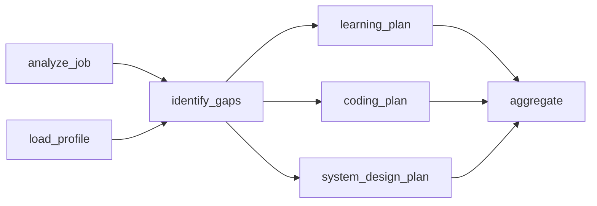
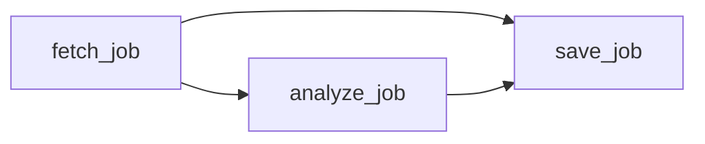

# Learning Guide

This project is meant to be both a useful local job-search agent and a learning vehicle for production-style AI agent applications.

The important idea: do not start with a fully autonomous agent. Start with a reliable workflow, then add agentic behavior only where fixed code is too rigid.

For the full project plan, see [Roadmap](roadmap.md).

This project is intentionally backend/agent focused. Frontend work should make the system demoable and pleasant to use, but the main learning value is in orchestration, memory, tool use, evaluation, persistence, and production-style architecture.

## Mental model

An agentic application usually combines five pieces:

1. State
   - What the app knows now.
   - Examples: your profile, jobs, application statuses, resume versions.

2. Tools
   - Safe actions the model or workflow can call.
   - Examples: parse a job, search jobs, save a job, update status, retrieve profile.

3. Orchestration
   - The control flow that decides which tools run and in what order.
   - Examples: analyze job -> score fit -> save job -> suggest prep topics.

4. Memory
   - Long-lived context that survives across requests.
   - Examples: skills, preferences, avoid-list, past applications.

5. Evaluation and observability
   - Ways to know whether the system behaved well.
   - Examples: test cases, traces, logs, score explanations, expected outputs.

## Agent Skill, Extraction Override, Prompt, Tool, and Workflow

These terms solve different problems:

| Concept | Responsibility | CareerPilot example |
| --- | --- | --- |
| Agent skill | Reusable guidance that may inform an agent | `app/agent_skills/career_page_extraction/SKILL.md` explains safe career-page extraction |
| Reviewed extraction override | Optional typed site-specific exception reviewed into Git | Microsoft's `override.yaml` says to prefer the `main` CSS content root |
| Learned selector observation | Local evidence about the currently working content root | A promoted `main` selector for a careers domain |
| Prompt | Instructions given to an LLM for semantic reasoning | Ask the parser to distinguish required from preferred qualifications |
| Tool | A bounded application capability | Fetch a page, parse a posting, score fit, or save a job |
| Workflow | A dependency-aware composition of tools | Load profile and analyze job, identify gaps, then generate preparation branches |
| Executor | Runtime infrastructure that schedules workflow tasks | Dependency-aware output passing, failure blocking, and traces |

Agent skills and extraction overrides make behavior reviewable. Tools create safe execution boundaries. Prompts handle semantic judgment. Workflows coordinate tools without turning every product action into an unconstrained model decision.

## DAG Foundation

CareerPilot now has framework-neutral DAG contracts under `app/workflows/`.

```text
WorkflowDefinition
  -> WorkflowTask[]
  -> dependency validation
  -> topological ready groups
```

For an interview-prep workflow:



The graph utility returns:

```text
[analyze_job, load_profile]
[identify_gaps]
[coding_plan, learning_plan]
[aggregate]
```

Each row is a dependency-ready group. The minimal executor currently runs tasks sequentially within each group. A later phase can run tasks in one group concurrently.

The current product workflow is smaller, but it demonstrates the same runtime contract:



The backend stores this as a `workflow_graph` artifact on the `AgentTask`, plus a `workflow_run` artifact with trace events such as `started`, `completed`, `failed`, and `blocked`. The frontend reads those artifacts to show the workflow instead of reconstructing orchestration from display text.

This maps naturally to AWS Step Functions:

| Step Functions | CareerPilot DAG | LangGraph later |
| --- | --- | --- |
| State machine | `WorkflowDefinition` | Graph |
| Task state | `WorkflowTask` | Node |
| `Next` | Dependency | Edge |
| Parallel state | Ready group | Parallel nodes |
| Retry / Catch | Future retry policy | Node retry policy |
| Execution history | Future workflow trace | Checkpoints and trace |
| Callback approval | Future paused run | Interrupt |

The DAG contract should survive a LangGraph migration. LangGraph may replace scheduling, checkpoint, and pause-resume mechanics, but it should not own CareerPilot's domain definitions, cache identity, cost policy, or approval rules.

## Current architecture

The app uses an explicit workflow with agent-shaped boundaries and an LLM semantic evaluator for job-fit judgment.

```text
HTTP request
  -> FastAPI route
  -> coordinator
  -> profile store
  -> optional job page fetcher
  -> deterministic parser normalization
  -> optional LLM structured parser
  -> required LLM semantic scorer
  -> optional LLM guidance generator
  -> SQLite repository
  -> response with fit, gaps, resume emphasis, prep topics
```

The coordinator keeps this sequence observable and testable. A later LangGraph migration can model the same steps as nodes without changing their ownership boundaries.

## Code map

`app/main.py`

FastAPI entry point. It defines the local API:

- `GET /health`
- `POST /jobs/analyze`
- `GET /jobs`
- `PATCH /jobs/{job_id}/status`

This layer should stay thin. It validates HTTP input and delegates work to the coordinator.

`app/agents/coordinator.py`

The workflow orchestrator. It coordinates profile loading, parsing, scoring, persistence, and suggestions.

In a future version, this is where we can introduce:

- OpenAI Agents SDK
- LangGraph
- tool calling
- routing between specialized agents
- human-in-the-loop checkpoints

`app/memory/profile.example.yaml`

A generic structured profile template. It shows the shape of the personal knowledge base without containing private information.

`app/memory/profile.local.yaml`

Your private structured personal knowledge base. It stores background, target roles, strengths, learning goals, must-haves, nice-to-haves, and avoid criteria.

This file is ignored by Git. Create it by copying `profile.example.yaml`.

The profile starts as YAML because it is easy to inspect and edit. Later, profile updates can be proposed by the agent and written through a controlled update flow.

`app/memory/profile_store.py`

Loads the profile from disk. This is deliberately small now, but it gives us a single place to add:

- validation
- change history
- profile update proposals
- profile versioning

Explicit assistant profile corrections also pass through this store. For example, if the user says "update my education background", the assistant extracts the education facts, writes them to `profile.local.yaml`, and records the change in `data/profile_audit.jsonl`. The key product rule is that durable profile memory changes need clear user intent or an explicit save button.

`app/tools/job_parser.py`

Extracts structured job information from a pasted description.

It uses conservative deterministic rules to normalize common fields and provide a parser fallback.

`app/tools/llm_job_parser.py`

Optional LLM-backed structured extraction. When `OPENAI_API_KEY` and the `ai` dependency extra are configured, the coordinator asks the model to extract a strict Pydantic schema from raw job text. Missing fields are filled from the deterministic parser.

If the OpenAI SDK or API key is missing, the app falls back to deterministic parsing and returns a parser warning in the API response.

The app loads local environment variables from `.env` automatically. Copy `.env.example` to `.env` for local API keys.

The LLM parser is the preferred source for open-ended technology extraction. It can extract new or uncommon skills without adding them to hardcoded maps.

`app/tools/job_fetcher.py`

Fetches a single job URL and extracts readable text from HTML.

This is intentionally conservative. It works for simple pages, then falls back to Playwright browser rendering when a job board uses JavaScript. Some login-required or blocked pages still require manual paste.

For the detailed design tradeoff and target-company ingestion path, see [Job Ingestion](ingestion.md).

`app/tools/scoring.py`

Defines the typed fit and evidence contracts returned by semantic scoring:

- fit score
- priority
- strong matches
- gaps
- concerns
- summary

The module deliberately does not contain a keyword scorer.

`app/tools/llm_job_scorer.py`

Required semantic scoring layer for job-fit analysis. The model evaluates the role against the user's profile, target roles, preferences, avoid-list, and career-transition goals.

The LLM scorer returns a structured rubric:

- role alignment
- current skill match
- career transition value
- seniority fit
- learning return on investment
- recommendation
- transition notes
- evidence for important matches, gaps, concerns, and recommendations

There is no deterministic scorer fallback. If semantic scoring is unavailable, the app reports that state explicitly because open-ended skill inference is too semantic for a keyword table to own.

Evidence-grounded analysis is now part of the contract. A gap or concern should not be just a naked claim; it should carry job evidence, a profile signal when relevant, severity, confidence, and source. Unsupported evidence is filtered before it reaches the UI.

Profile-aware evidence adds another layer of traceability. The scorer may include `profile_source_path` and `profile_evidence` for positive profile claims, such as `technical_strengths[0] -> Java` or `experience_highlights[3] -> Designed public pricing APIs`. This does not make the backend the semantic judge. The LLM still decides whether the role fits; deterministic code checks whether the cited profile fact exists and lowers confidence when the citation is unsupported. This is the production pattern to remember: use the model for judgment, use typed contracts and grounding checks for trust.

`app/tools/llm_job_guidance.py`

Optional LLM-backed application guidance. It turns parsed job facts and fit scoring into actionable output:

- apply reasoning
- prep plan
- resume guidance
- learning plan
- interview focus
- evidence for guidance items

This is the beginning of the "agentic analysis result" layer. It moves the app beyond scoring into coaching and preparation.

`app/db/models.py`

Defines application data models, including job records and application status values.

`app/db/repository.py`

SQLite persistence layer. It stores jobs and application status locally.

This is the right starting point because the app needs flexible local querying. A future production version can move to Postgres or a cloud-native architecture.

Newly saved jobs also store the full analysis payload as JSON. That gives the UI and future chat workflow a stable job-specific context without re-running the model.

The JSON payload is versioned. `jobs.analysis_json` holds the normalized current projection, while `job_analysis_versions` keeps append-only snapshots whenever an analysis is saved again or migrated. This matters because generated output becomes durable product data after users rely on it. A schema change should update the read model without erasing what the system originally produced.

Payload migrations live in `app/db/analysis_migrations.py`. The first migration removes the retired `guidance.risk_summary` field from the current projection because `fit.concerns` is now the single source of truth. Historical snapshots preserve the old shape for auditability.

This pattern now covers prep-plan revisions, persisted targeted resume PDFs, and profile-proposal revisions too. The shared `ArtifactProvenance` envelope records which workflow, model, prompt version, and schema version created an artifact. Even checklist completion is revisioned because it is user state that may matter when reviewing preparation progress.

The fit model separates hard gaps from growth areas. A missing minimum qualification belongs in `fit.gaps`; a preferred technology, optional qualification, or interview topic worth validating belongs in `fit.growth_areas`. This avoids presenting every useful preparation topic as a blocker. Accepted alternatives such as `C, C++, C#, Java, or Python` must also be evaluated as a group: a profile with Java or Python should not be told that lacking C# is a gap. When a career site flattens section headings or exposes apparently conflicting education and experience paths, the parser records them as `ambiguous_qualifications`; they remain validation topics rather than blockers.

`tests/test_job_analysis.py`

Basic regression tests for the core workflow.

The tests are part of the learning goal. Agent apps need evaluation because small prompt, scoring, or parsing changes can silently change behavior.

## Design patterns used

### 1. Workflow before agent

The current system is a fixed workflow:

```text
parse -> score -> save -> suggest
```

This is more reliable than giving a model full autonomy on day one. It also maps well to workflow-orchestration systems used in production software.

When to add more agentic behavior:

- The number of steps cannot be known upfront.
- The system needs to choose between multiple search strategies.
- The system needs to inspect intermediate results and decide whether to continue.

For this app, web research and interview prep are better candidates for agentic loops than application status tracking.

The job-analysis path has now been made explicit as a DAG:

```text
load_profile + prepare_input
  -> parse_job
  -> score_fit
  -> validate_fit
  -> generate_guidance
```

This is not LangGraph yet. It is a small internal executor that teaches the same platform concepts: approved tools, dependencies, dependency outputs, task status, and trace events. That matters because "agentic" production systems are rarely just one prompt. They are workflows where model calls, deterministic tools, validators, and user-facing artifacts have clear boundaries.

The useful interview framing is:

- The LLM performs semantic interpretation.
- The application layer owns task boundaries and durable contracts.
- The executor owns dependency order and traceability.
- The UI can show the workflow without knowing Python internals.

### 2. Thin API, thick application layer

FastAPI routes should not contain business logic. They should call application services such as the coordinator.

This keeps the system testable and makes it easier to add a CLI, background worker, or scheduled job later.

### 3. Repository pattern

The repository hides database details from the rest of the app.

The coordinator does not need to know whether jobs are stored in SQLite, Postgres, or DynamoDB. It calls `save_job`, `list_jobs`, and `update_status`.

This keeps storage replaceable without spreading SQL or database-specific logic everywhere.

### 4. Structured memory

The profile is structured YAML instead of chat history.

This matters because the agent needs reliable facts:

- current role
- technical strengths
- target roles
- avoid criteria
- learning goals

Raw chat history is useful context, but it is not a good source of truth.

### 5. Explainable scoring

The score is paired with matches, gaps, concerns, and a summary.

For agent applications, explanations are not just UX. They are debugging tools. If the score looks wrong, the explanation helps reveal whether parsing, memory, or scoring logic failed.

### Current Analysis Flow

The analysis response is generated in stages:

```text
job text / URL
  -> fetch readable text if needed
  -> deterministic metadata hints
  -> LLM structured requirement parser
  -> required LLM semantic scoring
  -> LLM fit validation
  -> one fit repair pass if needed
  -> optional LLM guidance generation
  -> resume emphasis suggestions
  -> prep topic suggestions
  -> save to SQLite tracker if requested
```

The LLM semantic scorer judges career-transition fit, such as whether a role is a realistic bridge toward the user's target direction even when it is not a perfect current-skill match.

This avoids reducing the product to simple keyword overlap.

The LLM semantic score is the only user-facing recommendation. Deterministic scoring was removed after it repeatedly produced misleading keyword-level judgments and leaked them into otherwise semantic analysis.

```text
LLM available:
  fit = LLM semantic score

LLM unavailable:
  return an explicit unavailable response
```

This makes the app more flexible for career-transition use cases without presenting brittle keyword overlap as a meaningful recommendation.

### Deterministic Code Role

Deterministic code now serves narrower purposes:

- normalize and pre-process fetched job text
- provide metadata and skill hints such as title, company, location, and obvious technologies
- validate schemas, evidence, duplicate strings, canonical labels, and consistency

It should not become an ever-growing catalog of every possible technology or requirement phrase. Requirement strength, accepted alternatives, preferred-vs-required distinctions, and gap judgment come from LLM structured extraction, semantic scoring, and fit validation. If semantic scoring is unavailable, CareerPilot returns an explicit unavailable response.

### 6. Human-in-the-loop updates

Profile and resume facts should not be silently changed by the model.

Implemented update flow:

```text
Resume/profile signal
  -> tool proposes structured profile updates
  -> assistant can refine the proposal
  -> user confirms
  -> app writes local profile memory
  -> accepted change is logged
```

This protects the profile from accidental drift. The same pattern should be reused across tools: agents propose, users approve, application services write durable state.

The Analyze Job workflow now follows the same philosophy:

```text
Job URL or pasted description
  -> tool produces analysis preview
  -> user reviews decision summary, risks, gaps, prep, resume, and role signals
  -> user can ask section-level follow-up questions
  -> user can mark feedback such as accurate, missing gap, wrong concern, or too generic
  -> user can hand off to prep-plan or resume workflows
  -> user explicitly clicks Save to tracker
  -> app writes the job and analysis payload to SQLite
```

This keeps the tracker from filling with low-quality or accidental analyses. It also creates a product-quality feedback loop: user review signals are stored locally in `data/analysis_feedback.jsonl`, and later we can convert repeated misses into eval fixtures.

There is also a background save path:

```text
Job URL
  -> create persistent AgentTask
  -> fetch page text
  -> analyze with the same parser/scorer/guidance workflow
  -> save job automatically
  -> UI polls task status and refreshes Applications
```

Saved-job regeneration reuses the same observable workflow:

```text
Saved Analysis drawer
  -> POST /jobs/{job_id}/regenerate-analysis
  -> fetch the stored source URL
  -> run current parser, semantic scorer, and guidance generator
  -> refresh the existing tracker row
  -> append an analysis-version snapshot
```

The source URL is the duplicate key. Re-analyzing a previously saved link updates the active projection in place while preserving historical analysis versions and the user's application status.

The first implemented task type is `job_link_ingest`. It stores task input, status, step history, artifacts, and errors in SQLite:

```text
AgentTask
  type = job_link_ingest
  status = queued | running | completed | failed
  input = { url, model/fetch options }
  steps = fetch_job, analyze_job, save_job
  artifacts = fetched metadata, analysis, saved job
```

This is intentionally shaped like a production queue workflow. Later it can move to a durable worker, retry policy, and LangGraph-style orchestration without changing the product concept.

Saved jobs are also classified as `internal_transfer`, `external_application`, or `unknown` by comparing the current company in profile memory against the parsed job company. This keeps job-search planning aware of the user's internal-transfer versus external-application paths.

### Unified assistant context

The assistant should feel like one product surface even when the user starts from different places.

Current direction:

```text
User message
  -> /assistant/chat
  -> active focus: global | analysis_preview | saved_job
  -> shared memory: profile, saved jobs, application statuses, chat history
  -> optional tool: web search
  -> answer
```

The active focus is a priority signal, not a wall. A saved-job chat can still use profile memory and compare against other saved jobs when the user asks. This avoids fragmented chat systems while keeping durable writes explicit and auditable.

The global Assistant can also invoke selected deterministic workflows through an action registry:

```text
User: "Save and analyze this job: https://..."
  -> detect allowed action: ingest_job_from_url
  -> create AgentTask
  -> run fetch_job, analyze_job, optional save_job
  -> show task progress in chat
```

This is intentionally different from letting the model execute arbitrary code. Chat handles intent and conversation; the action registry is a small allow-list; the workflow performs the durable operation with persisted state and errors. This is the production pattern to remember: flexible language input, constrained actions, observable execution.

### Context budget management

Fetched career pages can be much larger than a single job description. Search pages and JavaScript-heavy portals often include navigation, embedded state, repeated listings, and page chrome. Sending all of that into every LLM step can exceed the model context window and also weakens analysis quality.

CareerPilot now compacts oversized job text before analysis:

```text
fetched page text
  -> normalize repeated lines
  -> keep high-signal sections around responsibilities, qualifications, team, compensation
  -> cap analysis text to a fixed local budget
  -> record original and compacted lengths in AgentTask artifacts
```

When LLM parsing is enabled, oversized pages now use a chunked extraction path before falling back to compaction:

```text
oversized fetched page
  -> select high-signal chunks
  -> run structured LLM extraction per chunk
  -> merge extracted job facts
  -> run scoring and guidance on the merged ParsedJob
```

The product lesson: ingestion should produce a bounded, relevant context object before the LLM is called. A larger model window is useful, but it is not a replacement for context engineering. Chunked extraction is useful, but it should extract facts first rather than asking each chunk for a final fit recommendation.

The HTTP fetcher also prefers structured `JobPosting` JSON-LD when a career page exposes it. This is more reliable than scraping all visible portal text: large career sites may embed navigation, configuration, and unrelated application UI around a clean canonical posting description. JSON-LD is not automatically perfect, though. For individual URL analysis, CareerPilot attempts Playwright enrichment by default and combines rendered sections with canonical HTTP metadata. The resulting `ExtractedJobPosting` artifact contains ordered `{heading, items, source, order}` blocks. The LLM classifies those blocks semantically instead of depending on a hardcoded catalog of heading names. Background tasks record the artifact and extraction source for debugging.

Playwright extraction now has a small learning loop. It stores a learned selector observation per careers domain, promotes the selector after repeated successful quality checks, and rediscovers a content root if the page later drifts. This is intentionally different from autonomous code rewriting: web pages are untrusted input, so learned state contains selectors and observations rather than executable Python or JavaScript. The selected content root narrows context before model calls, reducing token cost and noise.

### 7. Evaluation as product behavior

Agent systems are probabilistic once LLM calls enter the loop. Tests should cover not only code correctness but also output quality.

CareerPilot now has a first job-analysis eval harness:

```text
frozen eval profile
  -> representative job descriptions
  -> analysis workflow
  -> assertions on recommendation, score, gaps, concerns, and extracted skills
```

Run it with:

```bash
careerpilot-eval --llm --json
```

Normal regression tests inject an explicit fake semantic evaluator to cover application behavior without hiding a product fallback. Run LLM evals before and after prompt/schema changes so you can compare reports and decide whether quality improved.

Eval examples should include:

- A strong AI platform job should score high.
- A frontend-heavy job should be penalized.
- A research scientist role should raise a concern.
- A duplicate job should not create a second application record.
- A duplicate source URL should not create a second application record.
- A deleted job should disappear from the tracker.
- Resume tailoring should not invent experience.

For details, see [Evaluation Strategy](evaluation.md).

## Why SQL first

SQLite is used for the MVP because the domain has relational data:

- jobs
- companies
- applications
- statuses
- resume versions
- prep plans

The app needs flexible questions like:

- Show high-fit jobs I have not applied to.
- Show jobs where Kubernetes is a gap.
- Show applications grouped by company.
- Show roles found this week with AI platform relevance.

Those are natural SQL queries.

DynamoDB can still be discussed as a production alternative for serverless workloads with predictable access patterns. It is not the best local-first starting point for this app.

## What to build next

Recommended sequence:

1. Add more job-analysis eval cases from real failures.
2. Move prep-plan generation onto a richer workflow DAG with parallel branches.
3. Add workflow cache keys, model routing, cost tracking, retries, and approval pauses.
4. Improve chat as a generic action surface across jobs, profile, prep plans, and resumes.
5. Add Docker once the workflow runtime shape is stable.
6. Compare one stable workflow with a LangGraph adapter.
7. Add target-company discovery after manual ingestion and analysis quality are stronger.

## Suggested reading

- Anthropic, Building Effective Agents: https://www.anthropic.com/research/building-effective-agents
- OpenAI Agents SDK: https://openai.github.io/openai-agents-python/agents/
- LangGraph docs: https://langchain-ai.github.io/langgraph/
- Anthropic, Writing Effective Tools for Agents: https://www.anthropic.com/engineering/writing-tools-for-agents
- Martin Kleppmann, Designing Data-Intensive Applications
- Chip Huyen, Designing Machine Learning Systems
