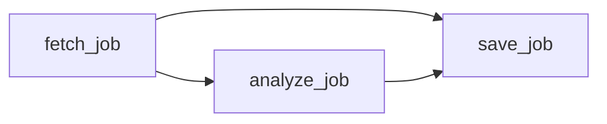
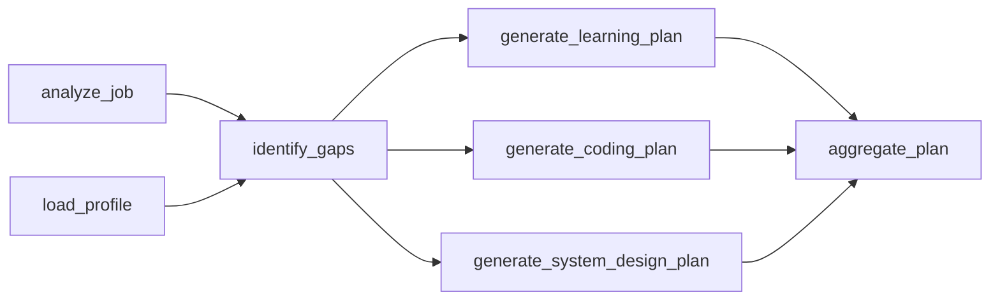

# Workflow Runtime

CareerPilot is the product domain. The workflow runtime is the reusable platform layer inside it.

The goal is to evolve real product workflows into observable, dependency-aware agent workflows without jumping straight to unconstrained autonomy.

## Current Runtime

CareerPilot has a framework-neutral workflow foundation under `app/workflows/`.

```text
WorkflowDefinition
  -> WorkflowTask[]
  -> dependency validation
  -> allow-listed tools
  -> dependency-output passing
  -> trace events
```

The executor currently:

- validates the DAG before execution
- rejects unregistered tools
- processes dependency-ready groups in topological order
- runs tasks sequentially within a ready group
- passes upstream outputs to downstream tools
- marks failed tasks as `failed`
- blocks transitive dependents
- continues unrelated branches when possible
- returns a `WorkflowRun` with outputs and trace events

## First Product Workflow

Background job ingestion is the first workflow template:



`save=false` runs the preview path:

```text
fetch_job -> analyze_job
```

`save=true` includes persistence:

```text
fetch_job -> analyze_job -> save_job
```

The API stores workflow artifacts on the `AgentTask` record:

- `workflow_graph`: nodes, edges, version, and final statuses
- `workflow_run`: status and trace events

The frontend visualizes those artifacts instead of reconstructing backend orchestration from text.

## Tool Boundary

Workflow tools are allow-listed executable capabilities.

```text
Tool
  input: task_input + dependency_outputs
  output: serializable artifact
```

Agent skills are different. A skill is reusable guidance that can be injected into a prompt. It is not executable authority.

```text
Agent skill -> guidance
Tool        -> bounded action
Workflow    -> approved graph of tools
Executor    -> runtime
```

## Next Runtime Capabilities

The next useful additions are:

1. Parallel execution within ready groups.
2. Cache keys for reusable outputs.
3. Model routing by task complexity.
4. Cost and latency accounting.
5. Retry policy and escalation.
6. Budget guardrails.
7. Approval pauses.
8. Persisted traces beyond current task artifacts.
9. Evaluation hooks per generated artifact.

## Prep-Plan DAG Target

The next richer workflow should be interview prep:



This demonstrates real platform concerns:

- independent branches
- shared state
- cache reuse
- cost tracking
- evaluation
- human review

## LangGraph Transition

LangGraph should not replace the domain model. It can replace or augment scheduling mechanics after CareerPilot has stable workflow contracts.

| CareerPilot | LangGraph |
| --- | --- |
| `WorkflowDefinition` | Graph definition |
| `WorkflowTask` | Node |
| dependency edge | edge |
| tool registry | node/tool callable |
| trace event | checkpoint/trace |
| approval pause | interrupt |

The migration goal is comparison, not framework worship. Keep domain tools, artifact contracts, cache keys, cost policy, and approval rules owned by CareerPilot.

## Interview Framing

> I started from a real product workflow instead of a toy agent demo. I extracted a small DAG runtime so I could learn dependency validation, output passing, failure blocking, and trace events. That gives me a concrete foundation for later model routing, caching, budgets, retries, approvals, and a LangGraph adapter.
