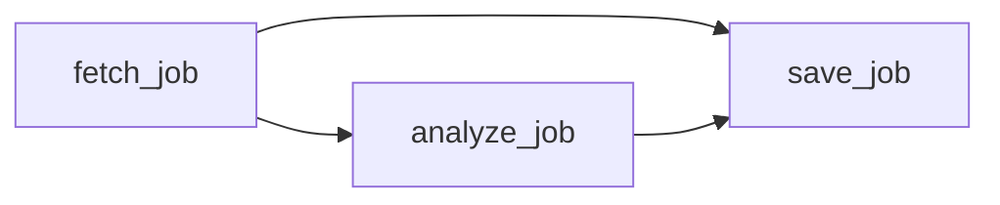
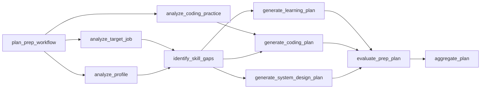

# Workflow Runtime

CareerPilot is the product domain. The workflow runtime is the reusable platform layer inside it.

The goal is to evolve real product workflows into observable, dependency-aware agent workflows without jumping straight to unconstrained autonomy.

## Current Runtime

CareerPilot has a framework-neutral workflow foundation under `app/workflows/`.

```text
WorkflowDefinition
  -> WorkflowTask[]
  -> dependency validation
  -> allow-listed tools
  -> dependency-output passing
  -> trace events
```

The executor currently:

- validates the DAG before execution
- rejects unregistered tools
- processes dependency-ready groups in topological order
- runs tasks sequentially within a ready group
- passes upstream outputs to downstream tools
- marks failed tasks as `failed`
- blocks transitive dependents
- continues unrelated branches when possible
- returns a `WorkflowRun` with outputs and trace events

## First Product Workflow

Background job ingestion is the first workflow template:



`save=false` runs the preview path:

```text
fetch_job -> analyze_job
```

`save=true` includes persistence:

```text
fetch_job -> analyze_job -> save_job
```

The API stores workflow artifacts on the `AgentTask` record:

- `workflow_graph`: nodes, edges, version, and final statuses
- `workflow_run`: status and trace events

The frontend visualizes those artifacts instead of reconstructing backend orchestration from text.

## Tool Boundary

Workflow tools are allow-listed executable capabilities.

```text
Tool
  input: task_input + dependency_outputs
  output: serializable artifact
```

Agent skills are different. A skill is reusable guidance that can be injected into a prompt. It is not executable authority.

```text
Agent skill -> guidance
Tool        -> bounded action
Workflow    -> approved graph of tools
Executor    -> runtime
```

## Next Runtime Capabilities

The next useful additions are:

1. Prep-plan workflow DAG with planner, analyzer, generator, evaluator, and aggregator nodes.
2. Persisted trace, latency, and cost-placeholder artifacts for prep-plan runs.
3. Parallel execution within ready groups.
4. Cache keys for reusable outputs.
5. Model routing by task complexity.
6. Cost and latency accounting.
7. Retry policy and escalation.
8. Budget guardrails.
9. Approval pauses.
10. Persisted traces beyond current task artifacts.
11. Evaluation hooks per generated artifact.

## Prep-Plan Agent Workflow

Interview prep is now the richer workflow target. This is the strongest near-term learning milestone because it exercises agent workflow orchestration, shared state, evaluation, and traceability without requiring cloud deployment first.



This demonstrates real platform concerns:

- planner/evaluator/aggregator separation
- independent branches
- shared state
- cache reuse
- cost tracking
- evaluation
- human review

The MVP persists:

- final prep plan artifact
- workflow graph and trace
- per-task status
- latency placeholder
- cost placeholder
- evaluation result

This keeps the API and UI product-oriented while exposing the runtime details needed for interview discussion.

The first implementation keeps generation compatible with the existing prep planner: the `aggregate_plan` node still calls the LLM or deterministic prep planner, while upstream nodes produce structured profile, job, coding-practice, gap, and branch-plan artifacts. Later stages can move more reasoning into specialized nodes without changing the workflow contract.

## LangGraph Transition

LangGraph should become the primary runtime for stateful orchestration, but it should not replace the domain model. CareerPilot owns approved workflow templates, domain tools, artifact contracts, persistence, evals, cache identity, cost policy, and approval rules. LangGraph owns graph execution, checkpointing, pause/resume, interrupts, conditional routing, and retry loops once those capabilities are needed.

| CareerPilot | LangGraph |
| --- | --- |
| `WorkflowDefinition` | Graph definition |
| `WorkflowTask` | Node |
| dependency edge | edge |
| tool registry | node/tool callable |
| trace event | checkpoint/trace |
| approval pause | interrupt |

CareerPilot now exposes a `WorkflowRuntime` boundary. The native runtime wraps the current in-process DAG executor. The LangGraph runtime can execute the same approved workflow template when LangGraph is installed, which lets the project compare behavior without rewriting product code.

Recommended transition sequence:

1. Use the LLM assistant planner for open-ended chat intent.
2. Run the prep-plan workflow through the `WorkflowRuntime` boundary.
3. Use LangGraph as the primary runtime for one workflow once the dependency is installed.
4. Add approval pause/resume with LangGraph interrupts.
5. Add retries, model routing, cache keys, and cost accounting behind the runtime boundary.
6. Persist workflow runs/checkpoints in queryable tables after the API contract stabilizes.

## Interview Framing

> I started from a real product workflow instead of a toy agent demo. I built typed workflow contracts, an allow-listed tool boundary, and a small native DAG runtime to learn dependency validation, output passing, failure blocking, and trace events. Then I introduced LangGraph behind a runtime interface so the project can use production-grade checkpointing, interrupts, and retry mechanics without giving up domain ownership.
